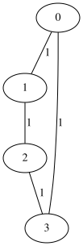

# petgraph for MoonBit

[](https://github.com/I3eg1nner/moonbit-petgraph/actions/workflows/ci.yml)

[English](README.md) | **中文**

Rust [petgraph](https://github.com/petgraph/petgraph) 库的 MoonBit 移植——快速、灵活的
**图数据结构与算法**,支持任意结点/边数据的有向图与无向图。

本移植聚焦 petgraph 最常用的核心:

- **`@graph`** —— 邻接表 `Graph[N, E]`(有向 & 无向),带类型化的 `NodeId`/`EdgeId`、
  邻居遍历、边查找,以及稳定的 swap-remove 语义。
- **`@unionfind`** —— 并查集(按秩合并 + 路径压缩)。
- **`@visit`** —— 遍历器 `Dfs`、`Bfs`、`DfsPostOrder`、`Topo`,以及事件驱动的
  `depth_first_search`。
- **`@algo`** —— `dijkstra`、`astar`、`bellman_ford`、`toposort`、环检测、
  `connected_components`、强连通分量(`kosaraju_scc` / `tarjan_scc`),以及
  `min_spanning_tree`(Kruskal)。
- **`@dot`** —— 导出 Graphviz **DOT** 用于可视化。

## 项目目标

提供一个清晰、地道、充分测试的 MoonBit 图库,其行为与 petgraph 一致,并配备持续集成、
文档与可复现的示例。架构与 Rust→MoonBit 的适配取舍见
[`docs/DESIGN.md`](docs/DESIGN.md)。

## 安装

这是一个标准的 MoonBit 模块。把它作为依赖加入你的项目:

```bash
moon add I3eg1nner/petgraph
```

然后在你所在包的 `moon.pkg` 里按需导入子包:

```json
{
  "import": [
    "I3eg1nner/petgraph/graph",
    "I3eg1nner/petgraph/algo",
    "I3eg1nner/petgraph/dot"
  ]
}
```

从源码构建本仓库:

```bash
git clone https://github.com/I3eg1nner/moonbit-petgraph.git && cd moonbit-petgraph
moon check        # 类型检查
moon test         # 运行测试套件
moon run src/cmd/main   # 运行演示
```

## 使用

构建一张图、运行算法、查看结果。下面这个示例会作为测试套件的一部分被编译并运行
(测试源在 `src/README.mbt.md`)。

```mbt check
///|
test "shortest path and spanning tree" {
  // 一张带 `Int` 结点权与边权的无向图。
  //
  //   0 -- 1
  //   |    |
  //   3 -- 2
  let g : @graph.Graph[Int, Int] = @graph.Graph::new_undirected()
  let n0 = g.add_node(0)
  let n1 = g.add_node(1)
  let n2 = g.add_node(2)
  let n3 = g.add_node(3)
  let _ = g.add_edge(n0, n1, 1)
  let _ = g.add_edge(n1, n2, 1)
  let _ = g.add_edge(n2, n3, 1)
  let _ = g.add_edge(n0, n3, 1)

  // 从结点 0 出发的最短距离(每条边的代价取其权重)。
  let dist = @algo.dijkstra(g, start=n0, edge_cost=fn(e) {
    g.edge_weight(e).unwrap()
  })
  // 到结点 2 的距离为 2(经 0-1-2 或 0-3-2)。
  debug_inspect(dist.get(n2), content="Some(2)")

  // 最小生成树(Kruskal):四元环恰好丢弃一条边。
  let mst = @algo.min_spanning_tree(g, edge_cost=fn(e) {
    g.edge_weight(e).unwrap()
  })
  debug_inspect(mst.length(), content="3")
}
```

用 `@dot` + Graphviz 渲染后,上面这张无向图看起来是这样:



图中每个椭圆是一个**结点**(标签是结点权重,本例设为其下标 `0`–`3`),每条连线是一条
无向**边**(标签是边权,这里都是 `1`)。这正是上面构建的四元环 `0–1–2–3–0`:从结点 `0`
出发的 `dijkstra` 距离为 `{0: 0, 1: 1, 2: 2, 3: 1}`,而 `min_spanning_tree` 会保留 4 条边
中的 3 条——丢弃环上的一条边。

把图导出为 Graphviz DOT 以便可视化:

```mbt check
///|
test "dot export" {
  let g : @graph.Graph[Int, Unit] = @graph.from_edges([(0, 1), (1, 2)])
  let dot = @dot.to_dot(g, config=[@dot.DotConfig::EdgeNoLabel])
  assert_eq(
    dot,
    (
      #|digraph {
      #|    0 [ label = "0" ]
      #|    1 [ label = "1" ]
      #|    2 [ label = "2" ]
      #|    0 -> 1 [ ]
      #|    1 -> 2 [ ]
      #|}
      #|
    ),
  )
}
```

遍历与环检测:

```mbt check
///|
test "traversal and cycles" {
  // 一张有向无环图(DAG):0 -> 1 -> 3, 0 -> 2 -> 3。
  let g : @graph.Graph[Int, Unit] = @graph.from_edges([
    (0, 1),
    (0, 2),
    (1, 3),
    (2, 3),
  ])
  // 在 DAG 上拓扑排序直接返回顺序;遇到有环图会 raise `@algo.Cycle`
  //(需要处理环时用 `try … catch` 捕获)。
  let order = @algo.toposort(g)
  debug_inspect(order.length(), content="4")
  // 不存在有向环。
  debug_inspect(@algo.is_cyclic_directed(g), content="false")
}
```

## 支持的接口

本库拆分为若干聚焦的子包,按需导入即可。下面采用 MoonBit 记法:`~` 表示带标签参数,
`?` 表示可选参数或 `Option` 结果,`raise` 表示可能抛出受检错误。

### `@graph` —— 图数据结构

- **构造**:`Graph::new()` / `Graph::new_undirected()`、
  `Graph::with_capacity(nodes, edges)`,以及 `from_edges(pairs)` /
  `from_edges_undirected(pairs)`——从 `(src, dst)` 下标对构建 `Graph[Int, Unit]`。
- **修改**:`add_node(w) -> NodeId`、`add_edge(a, b, w) -> EdgeId`、
  `update_edge(a, b, w)`(新增或覆盖)、`remove_node(n) -> N?`、
  `remove_edge(e) -> E?`(swap-remove,返回被删权重)、
  `set_node_weight` / `set_edge_weight`、`clear`、`clear_edges`、`reverse`(反转所有边方向)。
- **查询**:`node_count`、`edge_count`、`is_directed`、`node_weight(n) -> N?`、
  `edge_weight(e) -> E?`、`edge_endpoints(e) -> (NodeId, NodeId)?`、
  `find_edge(a, b) -> EdgeId?`、`find_edge_undirected`、`contains_edge`。
- **遍历**(均返回全新的、惰性的单次消费 `Iter`):
  `node_ids() -> Iter[NodeId]`、`edge_ids() -> Iter[EdgeId]`、
  `neighbors(n)` / `neighbors_directed(n, dir)` / `neighbors_undirected(n) -> Iter[NodeId]`、
  `edges_directed(n, dir) -> Iter[EdgeId]`、`externals(dir) -> Iter[NodeId]`(源点 / 汇点)。
- **类型**:`NodeId` / `EdgeId`(`::new`、`::index`)、`Direction`
  (`Outgoing` / `Incoming`、`.opposite()`)、`Directedness`,以及遍历与算法所泛化依赖的
  `NeighborSource` trait。

### `@unionfind` —— 并查集(按秩合并 + 路径压缩)

- `UnionFind::new(n)` / `new_empty()`、`new_set() -> Int`(追加一个元素)。
- `union(a, b) -> Bool`、`same_set(a, b) -> Bool`、`find(x) -> Int`、
  `into_labeling() -> Array[Int]`,以及带边界检查、返回 `Option` 的
  `try_union` / `try_same_set` / `try_find`。

### `@visit` —— 遍历

- 遍历器 `Dfs`、`Bfs`、`DfsPostOrder`、`Topo`:`::new(graph[, start])`,随后
  `.next(graph) -> NodeId?`;用 `reset` / `move_to` 重启。泛化于任意 `NeighborSource`。
- `depth_first_search(graph, starts, visitor)` —— 事件驱动的 DFS;`visitor` 收到一个
  `DfsEvent`(`Discover` / `TreeEdge` / `BackEdge` / `CrossForwardEdge` / `Finish`),
  返回一个 `Control`(`Continue` / `Prune` / `Break`)。
- `VisitMap` —— 以 `NodeId` 为键、可复用的已访问集合。

### `@algo` —— 算法

- **最短路径**:`dijkstra(g, start~, goal?, edge_cost~) -> Map[NodeId, K]`、
  `astar(g, start~, is_goal~, edge_cost~, estimate_cost~) -> (K, Array[NodeId])?`、
  `bellman_ford(g, source~, edge_cost~) -> BellmanFordPaths[K] raise NegativeCycle`。
- **排序与环**:`toposort(g) -> Array[NodeId] raise Cycle`、
  `is_cyclic_directed(g)`、`is_cyclic_undirected(g)`。
- **连通分量**:`connected_components(g) -> Int`、
  `kosaraju_scc(g)` / `tarjan_scc(g) -> Array[Array[NodeId]]`。
- **生成树**:`min_spanning_tree(g, edge_cost~) -> Array[EdgeId]`(Kruskal)。
- 边权泛化于 `Measure` trait(已为 `Int` 与 `Double` 实现)。

### `@dot` —— Graphviz 导出

- `to_dot(g, config?) -> String`(要求 `N : Show`、`E : Show`);`config` 是
  `DotConfig` 标志数组:`NodeIndexLabel`、`EdgeIndexLabel`、`EdgeNoLabel`、
  `NodeNoLabel`、`GraphContentOnly`。
- `to_dot` 只生成 DOT **字符串**;要渲染成图片需要安装
  [Graphviz](https://graphviz.org)(例如 `apt-get install graphviz`),再把字符串
  通过 `dot` 渲染:

  ```bash
  # 从 demo 中抽出 DOT 块并渲染。
  moon run src/cmd/main | sed -n '/^\(di\)\?graph {/,/^}/p' | dot -Tsvg -o graph.svg
  ```

  或把字符串贴到在线查看器,例如
  [GraphvizOnline](https://dreampuf.github.io/GraphvizOnline/)。

## 从 Rust petgraph 迁移

`petgraph_mbt` 的 API 高度贴合 petgraph——大多数名字完全一致,petgraph 代码几乎原样可读。
只有少数几处为顺应 MoonBit 惯用法做了有意的调整。

**完全一致的命名**

- `@graph`:`Graph::new` / `new_undirected` / `with_capacity` / `from_edges`;
  `add_node` / `add_edge` / `update_edge` / `remove_node` / `remove_edge`;
  `node_weight` / `edge_weight` / `edge_endpoints` / `find_edge` /
  `find_edge_undirected` / `contains_edge` / `node_count` / `edge_count` /
  `is_directed` / `externals` / `reverse`;`neighbors` / `neighbors_directed` /
  `neighbors_undirected`。
- `@algo`:`dijkstra`、`astar`、`bellman_ford`、`toposort`、`is_cyclic_directed`、
  `is_cyclic_undirected`、`connected_components`、`kosaraju_scc`、`tarjan_scc`、
  `min_spanning_tree`。
- `@visit`:`Dfs`、`Bfs`、`DfsPostOrder`、`Topo`、`depth_first_search`、
  `DfsEvent`、`Control`、`Direction::{Outgoing, Incoming}`。
- `@unionfind`:`UnionFind` —— `union` / `find` / `find_mut` / `new_set` /
  `into_labeling`。

**有意的差异**

| Rust petgraph | petgraph_mbt | 原因 |
|---|---|---|
| `NodeIndex` / `EdgeIndex` | `NodeId` / `EdgeId`(保留 `.index()`) | 更短;并非 Rust 的 index newtype |
| `node_indices()` / `edge_indices()` | `node_ids()` / `edge_ids()` | 随 `NodeId` 改名 |
| 具名迭代器(`Neighbors`、`NodeIndices` 等) | 惰性 `Iter[T]` | MoonBit 标准迭代器;`for x in …` 用法完全一致 |
| `toposort -> Result<_, Cycle>` | `toposort(…) raise Cycle` | MoonBit 错误惯用法——用 `try … catch` 捕获 |
| `bellman_ford -> Result<_, NegativeCycle>` | `… raise NegativeCycle` | 同上 |
| `Ty` 类型参数(`Directed` / `Undirected`) | 运行时 `new` 与 `new_undirected` 二选一 | 不用常量泛型表达有向性 |
| `FloatMeasure` / 数值约束 | `Measure` trait(`Int`、`Double`) | 手写的数值 trait |

## 文档

- [`docs/DESIGN.md`](docs/DESIGN.md) —— 架构与设计决策(英文)。
- [`docs/TESTING.md`](docs/TESTING.md) —— 测试方式说明(英文)。
- [`docs/TODO.md`](docs/TODO.md) —— 范围与迁移进度(英文)。

中文文档:

- [`docs/测试文档.md`](docs/测试文档.md) —— 详细测试文档(用例清单、覆盖率、缺陷修复)。
- [`docs/开发报告.md`](docs/开发报告.md) —— 开发报告(目标、设计决策、流程、问题与复现)。

## 许可证

采用 [MIT](LICENSE-MIT) 或 [Apache-2.0](LICENSE-APACHE) 双重许可,与上游 petgraph 保持一致。
